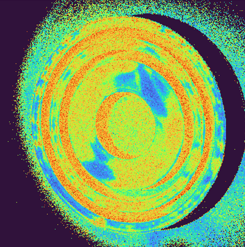

# Compression (Huffman algorithm) and analysis (Modified structure function) of speckle images 
### Code was developed for compression of **_grayscale_** speckle images. 
## Huffman encoder
The task is to create .bin files corresponding to speckle images with only one table of values and keys. Therefore, first, array consisting of average intensity values  of all images needs to be created. In the next step with implementation of **_huffmanenco_** function .bin file is created and saved. Simultaniously, information about original image and compressed file sizes is displayed. Finally, when all data is compressed, we  display total size of original and compressed files.
### Examples


```console
1.bmp
Original image size: 1266 Kb
Compressed image size: 1137 Kb
Image size reduced to: 90% 
```


```console
1.bmp
Original image size: 8881 Kb
Compressed image size: 3213 Kb
Image size reduced to: 36% 
```


```console
1.bmp
Original image size: 856 Kb
Compressed image size: 719 Kb
Image size reduced to: 84% 
```

## Huffman decoder
The output of this code is so called activity map, that shows distribution of activity within the object. Modified structure function algorithm is implemented in oder to build acivity map. First, you need to enter parameter m, which affects image quality. By choosing this parameter, we choose step between analized .bin files of encoded speckle images. After decoding set of .bin files with m step, activity map is builded. Below are show some examples of different samples.

### Examples 

#### 3D Printed Sample


#### Single Board Computer


#### Coin


